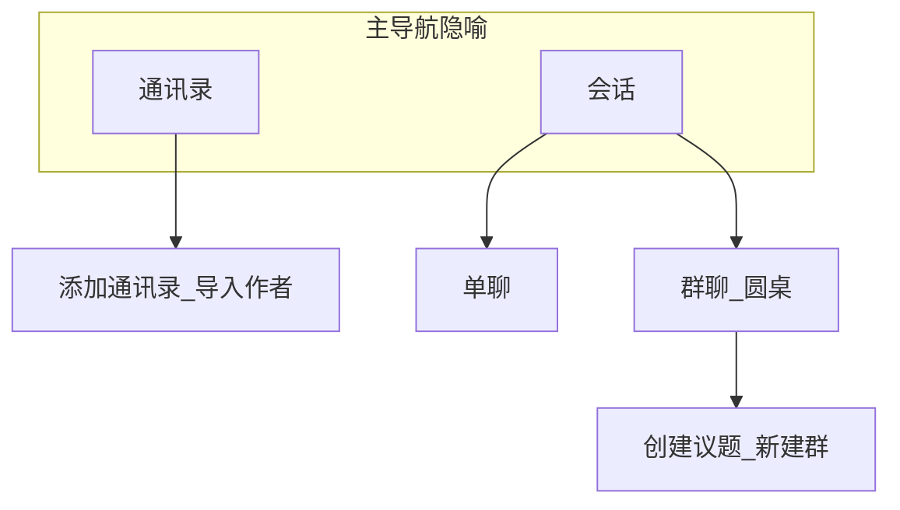

# MindRound 观思集 - 项目设计计划

> **极简 MVP 方案**: 见 [MVP功能清单.md](./MVP功能清单.md) - Windows 单平台，移除任务层级，聚焦核心聊天体验

## Context

跨平台深度阅读与对话应用：用户在读书后与「作者人格」对话。通过蒸馏得到的 SKILL 呈现思维方式，支持单聊与多人群聊（圆桌）。

**项目名称**: MindRound / 观思集  
**释义**: 观书见意，集思论道；Round 呼应圆桌与多视角讨论。

**核心定位**:
- 个人学习工具（非内容创作平台）
- 本地运行，用户自带 API 密钥
- 数据默认留在本机，隐私优先
- 便于导出对话用于分享或视频制作

---

## 交付阶段总览

| 阶段 | 目标 |
|------|------|
| **MVP** | 开发者本地可自测闭环：配置 API、通讯录作者、单聊/群聊、落盘历史、`memory.md` 与 30 分钟上下文生效。 |
| **生产部署** | 可交付给用户：安装包与签名、权限与数据目录、发布渠道、首次引导、导入/导出等完整性。 |
| **优化** | 无障碍、国际化、高级设置、本地使用统计、应用更新（含自动更新等）、深色/录屏模式、备份恢复、人物市场等；**超出早期设想的能力放在本阶段末段**。 |

**文档分工**:
- 本文档：方案、数据结构、阶段目标与各阶段**测试计划**。
- [功能清单.md](./功能清单.md)：按**业务与界面**列出三阶段下的**页面 → 操作项（按钮/入口）→ 功能 → 能力/验收**，供架构映射与验证；不写排期叙事。

---

## 技术方案

### 统一 Web 核心 + 平台壳层

**技术栈**:
- **前端**: React + Vite
- **桌面 (Windows)**: Tauri 2.0（Rust）
- **移动端 (Android)**: Capacitor 5
- **样式**: Tailwind CSS
- **状态**: Zustand
- **UI**: 自建组件，**对标微信**（桌面端与手机端布局与层级）

**理由**: 单仓迭代、Tauri 体积小、聊天类 UI 在 WebView 中成熟、可扩展 iOS/Web。

---

## 产品信息架构与布局

- **响应式**：窄屏（手机）与宽屏（桌面）均采用微信式**列表 + 会话**结构，避免固定「左任务右作者」仅适用于桌面的布局。
- **通讯录** = 全局作者列表（来源 `personae/`）；**添加通讯录** = **导入**作者（本地文件夹等；GitHub 导入见生产部署阶段）。
- **会话列表** = 与微信一致：单聊会话、群聊会话并列；从通讯录可发起单聊。
- **单聊**：一名用户 ↔ 一名作者；完整历史在本地可查，**请求模型时不发送全量历史**（见下文「上下文与记忆」）。
- **群聊（圆桌）** = 微信群聊；**创建议题** = **新建群聊会话**（主题/群名可对应微信「群聊名称」或议题标题）。群内多名作者按产品规则依次或按需生成回复，**不在 UI 上强调「第 N 轮」**。
- **设置**：API、数据目录、人物管理等入口；具体能力按阶段在功能清单中拆分。



---

## 对话上下文与记忆（取代「轮次」模型）

**原则**:
- 界面与产品文案**不突出「轮次」**；不以轮次为主轴做调度或展示。
- 本地**始终保存**完整消息历史，供浏览、搜索、导出。
- **每次调用模型**时，发往 API 的上下文字段由以下组成（实现时固定拼装顺序并写入测试用例）:

1. **时间窗口**：仅包含**发送请求时刻往前 30 分钟内**的消息（按消息 `timestamp` 与**设备本地时区**判断）。窗口内若无消息则仅依赖 `memory.md` 与用户本轮输入。
2. **`memory.md`**：与**当前会话**绑定的长期记忆文件（Markdown），存放**已提炼的要点**；由应用在适当时机**自动更新**（例如会话空闲后摘要、定时合并、或滑出窗口前的压缩策略——具体触发点在实现阶段定稿，须可测）。
3. **人格**：当前发言作者对应目录下 **SKILL.md 全文**作为该作者侧的 system 内容（与现有约定一致）。**群聊**中每一跳模型调用对应「当前发言的作者」，注入该作者的 SKILL.md；群会话共享同一份**该群的 `memory.md`**。

**文件位置建议**: 每个会话目录（或任务下的 `chats/<session-id>/`）内放置 `memory.md`，与对话 JSON 并列，便于备份与导出。

---

## UI/UX 要点（微信系）

**视觉**:
- 气泡、时间戳、头像位置参考微信；配色可参考：背景 `#ededed`、用户消息 `#95ec69`、对方消息 `#ffffff`、正文 `#333333`。
- 桌面与移动端遵循各自微信的布局习惯（侧栏/底栏、返回栈一致）。

**会话内**:
- 流式输出、「正在思考…」、多行输入、错误提示。
- 群聊中区分发言人（头像/昵称）；**不展示「当前第几轮/共几轮」**。

---

## 用户数据目录结构

```
User's Data Folder/
├── personae/                    # 全局作者库（通讯录数据源）
│   └── <name>-skill/
│       ├── SKILL.md             # 必需；全文作该作者 system
│       ├── README.md
│       ├── meta.json            # 可选
│       └── ...
└── tasks/                       # 任务/阅读语境（可选层级，可扁平化会话）
    └── <task-folder>/
        ├── info.json            # 任务/书籍元数据
        └── chats/
            ├── <session-id>/
            │   ├── chat.json    # 消息与元数据（名称可约定）
            │   └── memory.md    # 该会话长期记忆
            └── ...
```

单聊与群聊均为「一个会话目录」；群聊的 `chat.json` 中 `personae` 为多作者 id。

---

## 元数据与 SKILL.md

- **meta.json**（可选）用于列表展示：姓名、描述、标签、头像等。
- 无 meta.json 时可从 README 或 SKILL frontmatter 解析展示字段。
- **发往模型**：SKILL.md **整文件读取**，含 frontmatter，不做结构化剥离；与 distilled-persona-hall 思路一致。

（SKILL 正文示例可参考历史版本或示例仓库，此处从略以控制篇幅。）

---

## 数据格式要点

**单聊 `chat.json` 示例**（字段名可微调，须与实现一致）:

```json
{
  "id": "chat_20240415_142356",
  "type": "single",
  "personae": ["elon-musk-skill"],
  "task": "2024-04-15-Book-Title",
  "title": "可选会话标题",
  "messages": [
    {"role": "user", "content": "...", "timestamp": "2024-04-15T14:23:56+08:00"},
    {"role": "assistant", "persona": "elon-musk-skill", "content": "...", "timestamp": "2024-04-15T14:24:10+08:00"}
  ],
  "created_at": "2024-04-15T14:23:56Z"
}
```

**群聊 `chat.json` 示例**（**不**使用 `round` / `current_round` 作为产品模型；若内部暂存顺序字段，不应在 UI 暴露）:

```json
{
  "id": "group_20240420_150000",
  "type": "group",
  "topic": "科技行业的未来",
  "personae": ["elon-musk-skill", "steve-jobs-skill"],
  "task": "2024-04-20-Roundtable-Tech-Visions",
  "messages": [
    {"role": "user", "content": "...", "timestamp": "..."},
    {"role": "assistant", "persona": "elon-musk-skill", "content": "...", "timestamp": "..."},
    {"role": "assistant", "persona": "steve-jobs-skill", "content": "...", "timestamp": "..."}
  ],
  "created_at": "2024-04-20T15:00:00Z"
}
```

---

## 核心模块（实现视角）

| 模块 | 职责 |
|------|------|
| PersonaLoader | 扫描 `personae/`、读 SKILL.md 与展示元数据、缓存与热重载 |
| ChatEngine | 会话状态、流式请求、**按 memory.md + 30 分钟窗口 + SKILL** 组装 messages |
| GroupChatOrchestrator | 群聊内多作者回复顺序/触发策略（**不**以轮次为产品概念对外） |
| MemoryWriter | 根据策略更新 `memory.md`（可异步调用模型做摘要） |
| StorageManager | JSON 与文件系统、密钥安全存储（Windows DPAPI；Android Keystore/安全存储在生产阶段对齐） |
| Exporter | Markdown/纯文本导出（生产部署阶段与功能清单对齐） |
| SkillImporter | 本地/GitHub 导入（GitHub 相关在生产部署阶段） |
| UpdateChecker / AutoUpdate | **仅优化阶段** |

---

## 项目结构（建议）

```
mindround/
├── src/
│   ├── core/           # chat、persona、storage、export、memory
│   ├── ui/
│   ├── platforms/      # tauri、capacitor 适配
│   └── shared/
├── src-tauri/
├── android/            # Capacitor 生成
├── resources/
└── docs/
```

用户数据目录内 `personae/`、`tasks/` 由应用读写，不随仓库提交。

---

## API 策略

- **OpenAI 兼容** Base URL + Model + Key。
- 国内厂商在兼容前提下通过配置接入；不兼容时再单独适配（在功能清单中列为可选细项）。

---

## 各阶段测试计划

### MVP 阶段测试计划

- **范围**: 本地开发环境；API 配置；通讯录扫描与内置示例作者；单聊与群聊发送与流式展示；`chat.json` 与 `memory.md` 读写；30 分钟窗口边界（改系统时间或注入时间戳的单元测试）；密钥存储至少在 Windows 开发机验证。
- **类型**: 核心路径手工验收；ChatEngine / 时间窗口 / 记忆读写的单元测试。
- **完成标准**: 无阻断缺陷下可完成「加作者 → 单聊 → 建群 → 多轮发言 → 重启应用后历史仍在且模型上下文符合规则」。

### 生产部署阶段测试计划

- **范围**: Tauri 安装包与/或 Android APK；首次启动与数据目录；权限；本地与 GitHub 导入；导出；版本号与渠道说明；Android 密钥安全存储。
- **类型**: 干净环境安装测试；卸载/重装与数据目录迁移抽样；离线/弱网导入错误提示。
- **完成标准**: 目标用户可在文档指引下完成安装、配置、导入人物与备份对话；无明显阻塞性平台问题。

### 优化阶段测试计划

- **范围**: 无障碍抽样（Tab/读屏关键路径）、国际化切换、高级设置持久化、本地统计准确性、更新检查与自动更新（若实现）、深色主题与录屏模式、备份恢复、人物市场（若做）。
- **类型**: 回归测试清单；自动更新需在沙箱环境验证下载与失败回滚（若产品需要）。
- **完成标准**: 与功能清单中优化项一一对应验收；**人物市场等末段能力**单独勾选发布。

---

## GitHub 仓库结构建议

```
mindround/
├── personae/           # 内置或推荐人物（可选 submodule）
└── README.md
```

Releases 附 Windows 安装包与 Android 产物；**面向用户的更新提示/自动更新能力属于优化阶段**。

---

## 参考实现线索

读取 SKILL 后作为 system 消息发送；历史消息在客户端按本文规则裁剪后再附加——参考 distilled-persona-hall 的 `readSkill` + `chat.completions` 模式，但**必须**替换为「memory.md + 30 分钟窗口」而非全量 history。

---

## 与功能清单的关系

具体可交付功能点见 [功能清单.md](./功能清单.md)，按 **MVP → 生产部署 → 优化** 三节列出；本文不重复勾选表。
